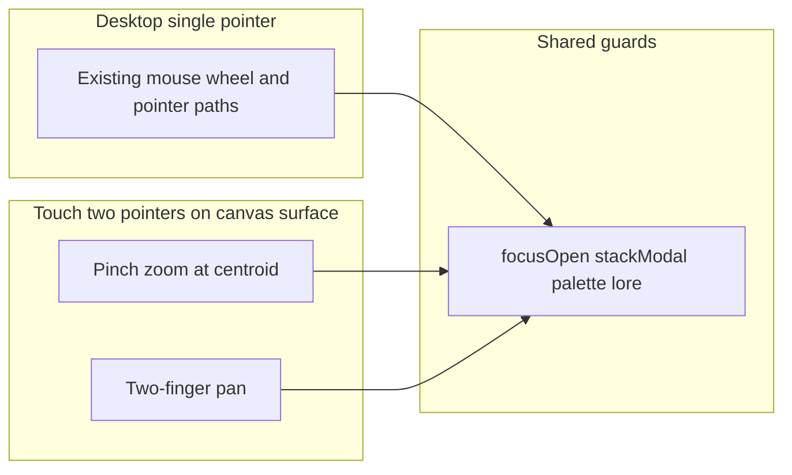

# Mobile fixes without desktop regression (including pinch zoom and touch navigation)

## Principles (regression control)

- **Scope visual/layout changes** to `@media (max-width: …)` (single breakpoint, e.g. **640px** or **768px**) so **desktop widths keep current geometry**.
- **Safe-area and `dvh`**: use **`max(24px, env(safe-area-inset-*))`** / **`max(28px, env(safe-area-inset-bottom))`**—on desktop, insets are **0** (no shift).
- **Canvas gestures**: extend **[`ArchitecturalCanvasApp.tsx`](heartgarden/src/components/foundation/ArchitecturalCanvasApp.tsx)** so **single-pointer `isPrimary` paths** (lasso, pan, node drag, connections) remain the **default on desktop**; multi-pointer logic activates only when **two active pointers** are on the viewport/canvas hit surface (see hit-test helper [`isCanvasPointerMarqueeOrPanSurface`](heartgarden/src/components/foundation/ArchitecturalCanvasApp.tsx)).
- **Interaction fixes** (Lore, ContextMenu): **`pointerdown`** so mouse + touch stay consistent.
- **Verify** with **`npm run check`**, **`npm run test:e2e:visual`**, **wide-window manual smoke**, and **390×844 + real device** for touch/pinch.
- **Interaction backlog:** See **§7** for double-tap vs dblclick, long-press menus, modifier-free multi-select, virtual keyboard, overscroll/back, and discoverability—address after core layout + gestures, with **narrow/hover media queries** or **touch-specific branches** so desktop stays unchanged.

---

## 1. Boot screen: stop poetry overlapping the flower tools rail

**Cause:** [`.content`](heartgarden/src/components/foundation/VigilAppBootScreen.module.css) centers copy with light horizontal padding while [`.flowerToolsRail`](heartgarden/src/components/foundation/VigilAppBootScreen.module.css) is absolutely positioned on the right—narrow viewports do not reserve a text column.

**Fix (mobile-only):** Under the chosen `max-width` breakpoint, add **`padding-inline-end`** (or equivalent) so copy clears the rail: e.g. `calc(var(--chrome-tool-rail-strip-width, 46px) + 32px)` plus any safe-area term if needed.

**Desktop:** No media match → **unchanged**.

---

## 2. Shell chrome: safe-area consistency

**Targets:** [`.shellTopLeftStack`](heartgarden/src/components/foundation/ArchitecturalCanvasApp.module.css), [`.bottomDock`](heartgarden/src/components/foundation/ArchitecturalCanvasApp.module.css) / [`.focusBottomDock`](heartgarden/src/components/foundation/ArchitecturalCanvasApp.module.css) / [`.bottomDockEnterHost`](heartgarden/src/components/foundation/ArchitecturalCanvasApp.module.css), [`.focusEffectsStrip`](heartgarden/src/components/foundation/ArchitecturalCanvasApp.module.css), [`.viewportMetricsStrip`](heartgarden/src/components/foundation/ArchitecturalCanvasApp.module.css), and matching **enter hosts** ([`.focusEffectsEnterHost`](heartgarden/src/components/foundation/ArchitecturalCanvasApp.module.css), [`.viewportMetricsEnterHost`](heartgarden/src/components/foundation/ArchitecturalCanvasApp.module.css), [`.bottomDockEnterHost`](heartgarden/src/components/foundation/ArchitecturalCanvasApp.module.css)).

**Fix:** `max(24px, env(safe-area-inset-*))` for top/left/right; **`max(28px, env(safe-area-inset-bottom))`** for bottom.

**Desktop:** Insets 0 → **same pixels as today**.

---

## 3. Viewport height: `100vh` + `100dvh` fallback

**Files:** [`.shell` / `.viewport`](heartgarden/src/components/foundation/ArchitecturalCanvasApp.module.css).

**Pattern:** `height: 100vh; height: 100dvh;` (optionally restrict the `dvh` line to the narrow breakpoint if you want zero theoretical desktop delta).

---

## 4. Post-boot right rail vs. narrow viewports (optional)

If overlap persists after Enter, apply the **same breakpoint** to [`.toolRailEnterShell`](heartgarden/src/components/foundation/ArchitecturalCanvasApp.module.css). **Skip** unless still needed after §1–2.

---

## 5. Lore panel + Context menu (pointer / touch scroll lock)

- **[`LoreAskPanel.tsx`](heartgarden/src/components/ui/LoreAskPanel.tsx):** Mirror [`CommandPalette.tsx`](heartgarden/src/components/ui/CommandPalette.tsx) **`touchmove`** guard; scrim dismiss via **`onPointerDown`** (target === currentTarget).
- **[`ContextMenu.tsx`](heartgarden/src/components/ui/ContextMenu.tsx):** **`pointerdown`** instead of **`mousedown`** for outside close.

---

## 6. Canvas: pinch-to-zoom and two-finger pan (native-feeling navigation)

**Goal:** On touch hardware, **two-finger pinch** scales the canvas about the gesture centroid (same idea as `updateTransformFromMouse` / wheel zoom), and **two-finger drag** pans (`translateX` / `translateY`), without breaking **mouse + wheel + keyboard** on desktop.

**Implementation outline (all in or beside [`ArchitecturalCanvasApp.tsx`](heartgarden/src/components/foundation/ArchitecturalCanvasApp.tsx)):**

1. **State/refs:** Track active pointers that are **on the viewport pan/zoom surface** (reuse hit-test rules: exclude `button`, `[data-hg-chrome]`, `[data-node-id]`, etc., same spirit as [`isCanvasPointerMarqueeOrPanSurface`](heartgarden/src/components/foundation/ArchitecturalCanvasApp.tsx)). Store `Map<pointerId, { x, y }>` or two stable contacts when count === 2.

2. **Pinch zoom:** On second pointer down or when two pointers move, compute **distance** (and optionally **midpoint** in viewport coords). Compare to **initial pinch distance** on gesture start; map ratio to scale with existing **`MIN_ZOOM` / `MAX_ZOOM`** and **`updateTransformFromMouse`** (or equivalent) so the **focal point** stays under the pinch center.

3. **Two-finger pan:** When both pointers move with **approximately constant distance** (rotation optional / defer), apply **delta of the midpoint** (or average of deltas) to `translateX` / `translateY`.

4. **Single-finger on canvas:** Keep current behavior: **select** → lasso or drag; **pan tool** / space-pan → single-finger pan. When a **second pointer** lands, **cancel** in-progress lasso/pan-from-one-finger if needed so state does not fight pinch.

5. **Focus / modals / palette:** If `focusOpen`, `galleryOpen`, `stackModal`, or palette/lore open—**do not** start or continue pinch-pan (mirror [`onWheel`](heartgarden/src/components/foundation/ArchitecturalCanvasApp.tsx) guards).

6. **`preventDefault` / `touch-action`:** To avoid **browser page zoom** and odd double-scroll, set **`touch-action: none`** on [`.viewport`](heartgarden/src/components/foundation/ArchitecturalCanvasApp.module.css) **or** the canvas surface only after confirming **scrolling inside node bodies** still works (scrollable regions may need **`touch-action: pan-y`** on `[data-node-body-editor]` or similar—match existing wheel “scrollable body” behavior). Use **`{ passive: false }`** only on listeners that call `preventDefault`, and **only during** active multi-touch gestures if possible to limit jank.

7. **Desktop regression checks:** No second pointer → existing **`onViewportPointerDown`**, **`onWheel`**, node drag, and connection modes unchanged. **Trackpad pinch** (if it synthesizes wheel+ctrl) should remain compatible with existing wheel zoom where it already works.

**Testing:** Manual iOS Safari + Android Chrome; optional Playwright **touch** APIs for a minimal regression test (harder than layout screenshots—treat as best-effort if flaky).

---

## 7. Additional interaction considerations (codebase audit)

These are **not all blockers** for a first mobile pass; they are a **thorough checklist** so nothing important is forgotten. Implement in priority order after layout, modals, and pinch/pan—**desktop behavior must stay default** when no touch/narrow rules apply.

### 7.1 Double-click / double-tap (high impact)

- **Today:** [`document.addEventListener("dblclick", …)`](heartgarden/src/components/foundation/ArchitecturalCanvasApp.tsx) opens **focus mode** (header hit), **opens folders**, exits connection draw/cut on empty canvas, etc.; cards also use React **`onDoubleClick`** ([`ArchitecturalFolderCard.tsx`](heartgarden/src/components/foundation/ArchitecturalFolderCard.tsx), [`ArchitecturalNodeCard.tsx`](heartgarden/src/components/foundation/ArchitecturalNodeCard.tsx)).
- **Touch risk:** Double-tap is **easy to miss or mis-time**; iOS/Android may **zoom the page** or interpret as two single taps; conflicts with **single-finger drag** starting on the same target.
- **Plan:** Prefer **explicit controls** that already exist (e.g. expand / open buttons, image gallery affordances) on **`(hover: none)`** or narrow breakpoint; optionally **suppress browser double-tap zoom** via `touch-action` (aligned with §6). Avoid changing desktop double-click semantics.

### 7.2 Context menu / “right-click” actions (high impact)

- **Today:** [`handleViewportContextMenuCapture`](heartgarden/src/components/foundation/ArchitecturalCanvasApp.tsx) drives **selection** and **stack** context menus; [`ContextMenu`](heartgarden/src/components/ui/ContextMenu.tsx) closes on outside **mousedown** (moving to **pointerdown** in §5). Connection lines use React **`onContextMenu`** on the canvas.
- **Touch risk:** **`contextmenu`** is **inconsistent** on iOS (often **no menu** on long-press for generic divs); users may **never see** duplicate/delete/stack actions.
- **Plan:** Add a **long-press** (or **`pointerdown` + timer**) path on nodes/stacks/connections that **reuses the same menu builders** as `contextmenu`, with cancellation on small movement; keep **right-click** unchanged on desktop.

### 7.3 Multi-select without keyboard modifiers (medium–high)

- **Today:** [`onMouseDown`](heartgarden/src/components/foundation/ArchitecturalCanvasApp.tsx) uses **`shiftKey` / `ctrlKey` / `metaKey`** to **toggle/extend** selection when dragging from a node.
- **Touch risk:** **No chord modifiers** on first pointer; users cannot **add/remove** from selection the way desktop users can.
- **Plan:** e.g. **“Selection mode” toggle**, **long-press “Add to selection”** in context menu, or a **multi-select** affordance in the dock—pick one pattern and apply consistently.

### 7.4 Keyboard-centric shortcuts (medium)

- **Heavy use** in [`ArchitecturalCanvasApp.tsx`](heartgarden/src/components/foundation/ArchitecturalCanvasApp.tsx): **Space** (temporary pan), **Delete/Backspace**, **Cmd/Ctrl+K** (palette—**mitigated** by a visible button that calls [`setPaletteOpen(true)`](heartgarden/src/components/foundation/ArchitecturalCanvasApp.tsx)), **Cmd/Ctrl+0** reset zoom, **/** or other navigation keys, **Escape** stacks/focus, **rich-text** **Cmd/Ctrl+B/I/U** ([`useEffect` on `keydown`](heartgarden/src/components/foundation/ArchitecturalCanvasApp.tsx) with `isTextFormattingToolbarTarget`).
- **Touch risk:** External keyboard absent on phones; **Bluetooth keyboard** users are fine.
- **Plan:** Ensure **every critical action** has a **visible tap target** (palette, zoom, pan tool, back, close, format toolbar in focus mode). Audit copy that only shows **⌘/Ctrl** ([`LoreAskPanel`](heartgarden/src/components/ui/LoreAskPanel.tsx), cmdk chrome) and add **plain-language** or on-screen submit on narrow viewports.

### 7.5 Command palette list highlight (low–medium)

- **Today:** Rows use **`onMouseEnter={() => setSelectedIndex(gi)}`** ([`CommandPalette.tsx`](heartgarden/src/components/ui/CommandPalette.tsx)); **tap** still runs **`onClick`**—so **activation works** without hover.
- **Gap:** **Keyboard-less** users do not get **hover-driven** highlight before tap; **`aria-activedescendant`** may not match first tap if index stays 0.
- **Plan:** Add **`onPointerEnter`** (or `onFocus` within roving tabindex) for rows **without breaking** mouse behavior; verify **screen reader** and **touch** highlight sync.

### 7.6 Tooltips and discoverability (medium)

- **Today:** [`ArchitecturalTooltip`](heartgarden/src/components/foundation/ArchitecturalTooltip.tsx) **returns early for `pointerType === "touch"`**—no tooltips on pure touch.
- **Gap:** **Icon-only** tool rail ([`ArchitecturalToolRail.tsx`](heartgarden/src/components/foundation/ArchitecturalToolRail.tsx)) and many chrome buttons **rely on labels in tooltips** for discoverability.
- **Plan:** On **`(hover: none)`** or narrow breakpoint: **fixed labels**, **overflow “…” menu**, or **bottom sheet** that lists tools with text—without duplicating clutter on desktop hover.

### 7.7 Clipboard and copy fallbacks (low–medium)

- **Today:** User-facing **`alert`** with manual **Ctrl+C / ⌘C** when automatic copy fails ([`ArchitecturalCanvasApp.tsx`](heartgarden/src/components/foundation/ArchitecturalCanvasApp.tsx) ~973).
- **Touch risk:** Clipboard often needs **user gesture**; instructions referencing **keyboard** confuse mobile users.
- **Plan:** Prefer **in-modal** “Copy” button + **`navigator.clipboard`** with **clear error UI**; avoid keyboard-only copy instructions on touch.

### 7.8 Virtual keyboard, visual viewport, inputs (medium)

- **Focus mode / editors:** Fixed chrome + scrollable sheet ([`.focusSheet`](heartgarden/src/components/foundation/ArchitecturalCanvasApp.module.css))—when the **software keyboard** opens, **caret and focused field** can sit **under the keyboard** unless you **`scrollIntoView`** on focus or listen to **`visualViewport`** resize/offset.
- **iOS:** Inputs with **font-size below 16px** can trigger **page zoom** on focus—audit **`textarea` / `input`** in Lore, cmdk, node bodies, focus mode.
- **Plan:** **`visualViewport`** adjustments where needed; ensure **minimum 16px** (or `1rem`) on editable fields for iOS; test **Lore** and **focus** flows on real devices.

### 7.9 System gestures: overscroll, pull-to-refresh, Android back (medium)

- **Pull-to-refresh** in mobile browsers/PWA can **reload** the app when the user means to **pan the canvas**—mitigate with **`overscroll-behavior-y: contain`** on [`html`/`body`](heartgarden/app/globals.css) / [`.shell`](heartgarden/src/components/foundation/ArchitecturalCanvasApp.module.css) where safe (some regions already use `overscroll-behavior` on cmdk/lore in [`globals.css`](heartgarden/app/globals.css)).
- **Android back:** Often maps to **history back**; if modals do not use **`history.pushState`**, back may **leave the app** instead of **closing Lore/cmdk/focus**. Optional improvement: **close top modal** on `popstate` or **`back` gesture** where supported.

### 7.10 Precision-heavy modes (lower priority)

- **Connection draw/cut:** Small pin targets and **crosshair** modes are **harder on finger** than with mouse; consider **larger hit slop** on touch or **snap** (future polish).
- **Lasso / marquee:** Already addressed by **pan tool + pinch/pan**; still validate **fat-finger** tolerance on small cards.
- **Link graph overlay:** [`LinkGraphOverlay.tsx`](heartgarden/src/components/ui/LinkGraphOverlay.tsx) uses **`touch-none`**—ensure **pan/zoom** inside that surface is intentional and documented for testers.

### 7.11 Hover-only visuals (mostly covered)

- **Today:** Several **`@media (hover: none)`** rules already **force** media action visibility ([`ArchitecturalCanvasApp.module.css`](heartgarden/src/components/foundation/ArchitecturalCanvasApp.module.css)); **boot glitch** is **hover-driven** ([`VigilAppBootScreen.module.css`](heartgarden/src/components/foundation/VigilAppBootScreen.module.css))—acceptable degradation on touch unless you want **tap-to-preview** glitch.
- **Plan:** Quick pass for any **hover-only critical state** (not just cosmetic) on coarser pointers.

---

## 8. Tests and guardrails

- **`npm run check`**, **`npm run test:e2e:visual`** (desktop baselines).
- **Wide window:** lasso, pan tool, wheel zoom, node drag, context menu, double-click focus, modifier multi-select.
- **Narrow / device:** boot layout, Lore + cmdk scroll lock, **pinch + two-finger pan**, **long-press menu**, **focus editor + keyboard open**, **no accidental pull-refresh**, **palette from visible button**.

---

## 9. Still defer (optional follow-up)

- **Next.js `viewport` / `viewport-fit=cover`** for installed PWA—after safe-area CSS lands.
- **Rotation** during two-finger gesture (rare); **simultaneous** pinch + pan tuning (polish).
- **Deeper** connection-mode touch targets and **graph overlay** gesture review (after core canvas gestures ship).

