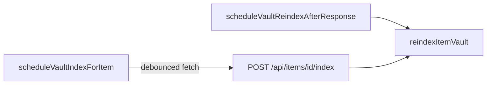

# heartgarden — HTTP API reference

Hand-maintained catalog of **`app/api/**`** routes. **Auth:** the app is single-user / local-first today; most routes do **not** verify a user session. Exceptions that require secrets are called out.

**Non-HTTP product behavior** (minimap, presence, vault index strip, wiki `[[` assist, culling, etc.) is indexed in **`docs/FEATURES.md`** with pointers into this file where APIs apply.

Conventions: successful JSON often includes `{ ok: true, … }`; errors `{ ok: false, error: string }` (legacy **`/api/v1/*`** uses `{ error: string }` only).

**Boot gate (edge):** When the PIN gate is enabled, root **`proxy.ts`** (matcher **`/api/:path*`**) rejects unauthenticated **`/api/*`** with **403** — same rules described historically as “middleware.” Details: **`src/lib/heartgarden-boot-edge.ts`**, **`AGENTS.md`** (Next dev leaves gate off by default).

## Client-only editor behavior (not HTTP)

**hgDoc** block reorder (six-dot grip in the focus / document sheet) runs entirely in the browser (`HgDocPointerBlockDrag`). It does **not** call a heartgarden API and is **not** listed in the tables below.

There is **no** supported **`/api/dev/*`** route in this catalog for editor or block-drag diagnostics. Use browser DevTools or ad-hoc logging during development.

## Bootstrap

| Method | Path | Purpose |
|--------|------|---------|
| GET | `/api/bootstrap` | Active space, spaces list, items (subtree), **`braneId`** (the partition the active space lives in — see **Branes & mentions** below), **`camera`** (see subsection below). **`PLAYWRIGHT_E2E=1`** forces empty demo payload (tests only). With boot gate on, **`proxy.ts`** returns **403** without a valid **`hg_boot`** cookie (except **`/api/heartgarden/boot`**), unless **`Authorization: Bearer`** matches **`HEARTGARDEN_MCP_SERVICE_KEY`**. With a valid **`player`** tier cookie, scopes to the resolved Players root (env UUID if set, else implicit dedicated space; 403 if misconfigured). **`demo`** tier should not call this in normal clients (local canvas only). |

### `camera` in the bootstrap JSON

Responses include **`camera`**: `{ x, y, zoom }` parsed from legacy **`spaces.canvas_state`**. The **shipped heartgarden web shell** does **not** use this value for the initial viewport — it applies **`defaultCamera()`** (world origin centered, zoom 1) and persists pan/zoom in **browser-local storage** per space while you work (`heartgarden-space-camera-v1`; see **`AGENTS.md`** → Canvas camera). Treat **`camera`** as **compatibility / debugging** for API consumers; do not assume it matches first paint in the official UI. The shell does not write viewport back to **`canvas_state`**.

## Boot gate (splash PIN)

| Method | Path | Purpose |
|--------|------|---------|
| GET | `/api/heartgarden/boot` | **`{ gateEnabled, sessionValid, sessionTier, playerLayerMisconfigured? }`** — no secrets. **`sessionTier`** is **`"access"`** (Bishop), **`"player"`**, **`"demo"`**, or **`null`**. Gate is **off** when **`PLAYWRIGHT_E2E=1`**, when **`HEARTGARDEN_BOOT_SESSION_SECRET`** is shorter than **16** characters, or when no PIN is exactly **8** characters (**Bishop**, **Players**, and/or **demo**). Clients may still see legacy **`"visitor"`** until they refresh against a new deploy; treat like **`"player"`**. |
| POST | `/api/heartgarden/boot` | Body **`{ code }`** — exactly **8** characters (after trim); **PIN match is case-insensitive**. On success: **204** + **`Set-Cookie`** `hg_boot` (httpOnly, signed tier **access**, **player**, or **demo**). On failure: **401** with constant **`{ error: "Access denied." }`**. Too many attempts from one client IP: **429** **`{ error: "Too many requests." }`** (in-memory limit per instance; see env below). |
| DELETE | `/api/heartgarden/boot` | Clears **`hg_boot`** (e.g. after in-app **Log out**). **204**. |

**Env:** **`HEARTGARDEN_BOOT_PIN_BISHOP`**, optional **`HEARTGARDEN_BOOT_PIN_PLAYERS`**, optional **`HEARTGARDEN_BOOT_PIN_DEMO`**, **`HEARTGARDEN_BOOT_SESSION_SECRET`**, optional **`HEARTGARDEN_BOOT_SESSION_MAX_AGE_SEC`**, optional **`HEARTGARDEN_PLAYER_SPACE_ID`**, optional **`HEARTGARDEN_GM_ALLOW_PLAYER_SPACE=1`** (GM break-glass). See **`docs/VERCEL_ENV_VARS.md`** and **`docs/PLAYER_LAYER.md`**.

## MCP (Model Context Protocol)

| Method | Path | Purpose |
|--------|------|---------|
| GET, POST, DELETE | `/api/mcp` | **Streamable HTTP** MCP transport (same JSON-RPC surface as **`npm run mcp`** stdio). **Auth (any one):** header **`Authorization: Bearer <HEARTGARDEN_MCP_SERVICE_KEY>`**, or header **`X-Heartgarden-Mcp-Token`**; query **`?token=`** / **`?key=`** is accepted only when **`HEARTGARDEN_MCP_ALLOW_QUERY_TOKEN=1`**. Returns **503** if **`HEARTGARDEN_MCP_SERVICE_KEY`** is unset. **401** if none match. **`proxy.ts`** allows this path through the boot gate without **`hg_boot`** so the route can respond; auth is enforced in the handler. Stateless (**no** session stickiness) for serverless. |

**Tooling:** Shared logic lives in **`src/lib/mcp/heartgarden-mcp-server.ts`**.

**Tool names:** **`tools/list`** advertises only **`heartgarden_*`**. **`tools/call`** still accepts legacy **`vigil_*`** names and maps them to **`heartgarden_*`** via **`canonicalHeartgardenMcpToolName`** (see **`heartgarden-mcp-server.test.ts`**). Write tools validate **`write_key`** against **`HEARTGARDEN_MCP_WRITE_KEY`** in the MCP process; **`write_key`** may be omitted when the MCP server has **`HEARTGARDEN_MCP_WRITE_KEY`** set. **`heartgarden_mcp_config`** returns booleans only (**`default_space_configured`**, **`mcp_read_only`**, **`write_key_configured`**)—no env values. **`heartgarden_create_item`** → **`POST /api/spaces/:id/items`**; **`heartgarden_create_folder`** → **`POST /api/spaces`** then folder **`POST .../items`**; **`heartgarden_create_link`** → **`POST /api/item-links`** (**`relationship_type`** → **`linkType`**, canonical: `bond|affiliation|contract|conflict|history`; legacy aliases normalize server-side); **`heartgarden_patch_item`** → **`PATCH /api/items/:id`**. Prose input precedence for create/patch is **`content_json` > `content_blocks` > `content_markdown` > `content_text`**; markdown + typed blocks compile to hgDoc with heading lint/repair and H1 auto-prepend for generic docs. MCP size guards apply consistently across `content_text`, `content_markdown`, `content_blocks`, and `content_json` (2M serialized-char cap). **`heartgarden_get_item_outline`** returns a heading outline for an item's hgDoc body. **`heartgarden_traverse_links`** expands neighbors 1–2 hops from an item; default behavior traverses explicit `item_links`, and the new **`implicit_mode: true`** flag also includes `entity_mentions` neighbors (term-based implicit edges). **`heartgarden_entity_mentions`** returns implicit mention edges for one item — outgoing mentions (terms in this item's body that match other items' vocabulary) and items that mention this one. Data model for agents: **`docs/MCP_CANVAS_MODEL.md`**.

**Create-item entity fields (HTTP + MCP):** If **`entityType`** is set on the body, it wins. Else **`canonical_entity_kind`** maps to **`entityType`** via the registry. Lore shells (**`character`** \| **`faction`** \| **`location`**) with **`note`**/**`sticky`** and no client **`contentJson`** get server-synthesized lore HTML (same as the UI). MCP tool descriptions spell out **`lore_entity`** vs **`canonical_entity_kind`** vs **`entity_type`**.

**Lore vs chunks:** **`POST /api/lore/query`** synthesizes one answer (Claude) from retrieval; **`GET /api/search/chunks`** returns raw chunk hits—see MCP tools **`heartgarden_lore_query`** vs **`heartgarden_semantic_search`**.

**Claude Desktop (remote connector):** Add the server under **Settings → Customize → Connectors** (not only `claude_desktop_config.json` for remote URLs). Set **Remote MCP server URL** to **`https://<host>/api/mcp?token=<HEARTGARDEN_MCP_SERVICE_KEY>`** (percent-encode the token if it contains **`&`**, **`+`**, **`#`**, etc.). Remote traffic is brokered from **Anthropic’s cloud**; your deployment must be **public HTTPS** (see Anthropic’s published egress IP ranges). **Do not** use a normal browser tab as the test: address-bar navigation is not an MCP client; use **`npm run mcp:smoke`** (below) or MCP Inspector.

**Vercel Deployment Protection:** If **Vercel Authentication** / SSO / password protection is enabled on the hostname you use, **MCP requests never reach this app** (the edge shows a login wall). **Turn off protection for Production** (or protect Preview only), or use Vercel’s **automation bypass** as an extra **`&x-vercel-protection-bypass=`** query param (see **`docs/DEPLOY_VERCEL.md`** § MCP and Deployment Protection). Claude cannot send **`x-vercel-protection-bypass`** as a header.

**Verify from CLI (recommended):** From **`heartgarden/`**, with the same secret as Production:

`HEARTGARDEN_MCP_SERVICE_KEY=… npm run mcp:smoke`

Optional **`HEARTGARDEN_MCP_URL`** (default `https://heartgarden.vercel.app/api/mcp`) points at **`/api/mcp`**. Optional **`HEARTGARDEN_VERCEL_PROTECTION_BYPASS`** adds Vercel’s **`x-vercel-protection-bypass`** query param for smoke tests against a protected deployment. Uses **`@modelcontextprotocol/sdk`** `StreamableHTTPClientTransport` + **`Client`** — same wire protocol as Claude Desktop. Success prints server info and a tool count; failure usually means wrong key, missing env on the server (**503**), or network.

## Spaces

| Method | Path | Purpose |
|--------|------|---------|
| GET | `/api/spaces` | List spaces. |
| POST | `/api/spaces` | Create space. **GM:** optional top-level row (`parentSpaceId` omitted) or child of an allowed parent. **Player:** **`parentSpaceId` required** — must be the Players root or a folder space under it (`spaceIsUnderPlayerRoot`); cannot supply **`id`** (no client-chosen UUID). |
| PATCH | `/api/spaces/[spaceId]` | Update **name** and/or **`parentSpaceId`** (UUID or `null`). **Only** those fields are accepted; unknown legacy fields (including `camera`) now return **400**. `parentSpaceId` is **GM-only** (rejected for **player**); requires access to both this space and the new parent; the server rejects moves that would create a **parent cycle**. Use this to keep a folder’s inner space aligned when its folder card moves between canvases. |
| DELETE | `/api/spaces/[spaceId]` | Delete space (cascade per schema). |
| GET | `/api/spaces/[spaceId]/changes` | Query **`since`** (ISO timestamp). Response includes **`items`** (changed item rows) and **`cursor`** (max of item + space `updated_at` in range). **`hasMore`**: when true, more rows exist after **`cursor`** — call again with **`since=<cursor>`** until **`hasMore`** is false (default page size **`limit=500`**, max 500). Includes **`itemLinksRevision`** (aggregate fingerprint over **`item_links`** touching this space on **source or target**) so clients can detect link-only changes without downloading the full graph every poll. When any subtree **`spaces`** row changed since **`since`** (e.g. folder reparent / rename), **`spaces`** lists **`{ id, name, parentSpaceId, updatedAt }`** so other clients can merge without a full bootstrap. Optional **`includeItemIds=1`**: when set, response **must** include **`itemIds`** (full subtree id list for tombstone sync). When omitted, **`itemIds`** is omitted — lighter for non-shell clients. The **official web shell** sends **`includeItemIds=1`** on the **first** page of a delta poll, then omits it on continuation requests while **`hasMore`** (see **Browser shell — delta sync** under **Items**). |
| GET | `/api/spaces/[spaceId]/link-revision` | Returns **`{ ok: true, itemLinksRevision }`** — cheap **`item_links`** fingerprint for the space (same scope as **`GET …/graph`**). Use when the WebSocket path is down or to decide whether to **`GET …/graph`** after a revision bump. |
| GET | `/api/spaces/[spaceId]/presence` | Optional **`?except=<clientUuid>`**. Optional **`scope=local`** — restrict to peers whose **`activeSpaceId`** equals **`spaceId`**; **default** (omit param) returns peers in **`spaceId`’s entire subtree** (descendant child spaces included). Each peer: **`clientId`**, **`activeSpaceId`**, **`camera`** `{ x, y, zoom }`, **`pointer`** `{ x, y } \| null` (world coordinates), optional **`displayName`**, optional **`sigil`** (`thread` \| `quill` \| `atlas` \| `bloom`), **`updatedAt`** (ISO). TTL **~2 minutes**. Presence GC is throttled server-side (not on every request). |
| POST | `/api/spaces/[spaceId]/presence` | Body **`{ clientId: uuid, camera: { x, y, zoom }, pointer?: { x, y } \| null, displayName?: string, sigil?: "thread" \| "quill" \| "atlas" \| "bloom" }`**. URL **`spaceId`** is the client’s active canvas space (must match access rules). Upserts **one row per `clientId`** in **`canvas_presence`**. `displayName` is sanitized server-side (trim/collapse spaces, 32-char cap, conservative char allowlist); invalid names are dropped to `null`. Rate-limited **per public IP** (in-memory per server instance). **`PLAYWRIGHT_E2E=1`** bypasses. Stale-row GC is throttled globally (older than server TTL). **`429`** if rate limited. Requires **`canvas_presence`** in Postgres (`npm run db:push` after schema pull). |
| DELETE | `/api/spaces/[spaceId]/presence` | Query **`clientId=<uuid>`** (required). Removes that client’s row from **`canvas_presence`** so peers stop seeing a ghost avatar before TTL prune. Fired from the browser via **`fetch({ method: "DELETE", keepalive: true })`** on **`pagehide`** (tab close / navigation away) and on **`enabled`** flip / component unmount. URL **`spaceId`** must still pass space access. **Player**-tier callers only delete rows inside their allowed subtree (blocks cross-tier griefing); GM-tier deletes by `clientId` unconditionally. Shares the **`POST`** rate-limit bucket (same `HEARTGARDEN_PRESENCE_POST_RATE_LIMIT_*`); tab-close traffic is ~1 request per close, negligible compared to the heartbeat quota. **`400`** if `clientId` is missing or not a UUID, **`429`** if rate limited, **`PLAYWRIGHT_E2E=1`** bypasses. |
| GET | `/api/spaces/[spaceId]/items` | Items for space. |
| POST | `/api/spaces/[spaceId]/items` | Create item in space. Body: **`itemType`**, **`x`**, **`y`**, optional **`width`**, **`height`**, **`title`**, **`contentText`**, **`contentJson`**, optional **`theme`**, **`entityType`**, **`entityMeta`**, **`canonical_entity_kind`** (maps to **`entityType`** via import registry), **`lore_variant`** (`v1`–`v3` / `v11`; `v4` is not accepted by this route). `entityType` is validated against the persisted allowlist (`character|faction|location|quest|item|lore|lore_source|other`). If **`zIndex`** is omitted, **`max(zIndex)+1`** in that space (starts **101** when empty). Default dimensions: lore shells (**`entityType`** **`character`** \| **`faction`** \| **`location`**) **340×280**; plain note **340×270**; checklist **340×188**; other **280×200**. If **`contentJson`** is omitted and **`entityType`** is a lore shell kind, the server builds the same HTML + **`hgArch.loreCard`** as the canvas UI (`getLoreNodeSeedBodyHtml`). Otherwise omitted **`contentJson`** for **`note`**/**`sticky`**/**`checklist`** uses generic synthesis. **`contentText`** is required for plain **`note`** rows when **`contentJson`** is omitted (unless **`canonical_entity_kind`** / lore entity will supply text). |
| GET | `/api/spaces/[spaceId]/graph` | Graph JSON export for space. |
| GET | `/api/spaces/[spaceId]/summary` | Short summary for tooling / MCP. |
| POST | `/api/spaces/[spaceId]/reindex` | Vault reindex for all items in space. **Body:** `{ write_key }` must match **`HEARTGARDEN_MCP_WRITE_KEY`**. Optional `refreshLoreMeta`. Rate-limited. |

## Items

| Method | Path | Purpose |
|--------|------|---------|
| PATCH | `/api/items/[itemId]` | Partial update (geometry, content, entity meta, stack, …). Body may include **`contentText`** (plain) and/or **`contentJson`**. Persisted `contentJson` is wrapper-shaped (`{ format: "hgDoc", doc, hgArch }` for hgDoc cards; `{ format: "html", html, hgArch }` for HTML/lore/media cards), not a bare TipTap root. **`baseUpdatedAt`** (ISO) is required when changing title/body/entity/image fields and must match row **`updated_at`**; otherwise returns **400** (missing/invalid) or **409** conflict (`{ ok: false, error: "conflict", item }`). Missing item → **404**; the shell drops the entity locally (remote delete). `entityType` is validated against the persisted allowlist (`character|faction|location|quest|item|lore|lore_source|other`). Success returns **`{ ok: true, item }`** (includes **`updatedAt`**). Triggers search blob / optional vault scheduling per implementation. **Browser shell** behavior: see **Browser shell — PATCH versioning and conflicts** (after this table). |
| DELETE | `/api/items/[itemId]` | Delete item. |
| POST | `/api/items/[itemId]/embed` | Clear stale `item_embeddings` rows for item (does not embed). |
| POST | `/api/items/[itemId]/index` | Chunk + optional lore meta (Anthropic). When **`OPENAI_API_KEY`** is set, writes chunk vectors via **`src/lib/embedding-provider.ts`** (default **`text-embedding-3-small`**); without it, lexical search data and lore meta still refresh. Rate-limited. |
| GET | `/api/items/[itemId]/links` | Link neighbors. |
| GET | `/api/items/[itemId]/related` | Related-items heuristic. |

### Vault index orchestration

Per-item vault work (**chunking, embeddings, optional Anthropic lore summary/aliases**) funnels into **`reindexItemVault`** (`src/lib/item-vault-index.ts`) via **`POST /api/items/[itemId]/index`** and server **`after()`** scheduling (`schedule-vault-index-after.ts`). Current default owner is server `after()`; client debounced **`POST …/index`** is a no-op when **`NEXT_PUBLIC_HEARTGARDEN_INDEX_OWNER=server_after`**. `after()` reindex uses **`refreshLoreMeta: false`** to avoid duplicate Anthropic calls. See **`AGENTS.md`** → Lore + vault index for env toggles.

### Browser shell — PATCH versioning and conflicts

The shipped canvas (`ArchitecturalCanvasApp` → **`patchItemWithVersion`**) keeps a client map of each item’s last known server **`updatedAt`** and sends **`baseUpdatedAt`** on PATCH when available. **`apiPatchItem`** runs **at most one in-flight fetch per item id** (serialized queue). On **409 conflict**, the UI may **retry once** using **`item.updatedAt`** from the error body; if the second write still conflicts, it queues a **conflict banner** (load server row vs dismiss and keep local draft). **`recordItemPatchOk`** / **`recordItemPatchConflict`** in **`heartgarden-collab-metrics.ts`** count successful PATCHes vs 409 conflicts; **`window.__heartgardenCollabMetrics`** exposes space-sync run counts (including **`poll_catchup`**) for ad-hoc debugging.

Set **`NEXT_PUBLIC_HEARTGARDEN_SYNC_DEBUG=1`** in **`.env.local`** to **`console.debug`** each PATCH’s latency, HTTP status, and **`baseUpdatedAt`** from the client (`src/lib/heartgarden-sync-debug.ts`).

### Browser shell — delta sync (`GET …/changes`)

The **`useHeartgardenSpaceChangeSync`** hook requests **`includeItemIds=1`** only on the first page of a poll cycle (and at reconciliation intervals), then uses cursor deltas for continuation pages. Tombstone deletes only run when a response explicitly includes `itemIds`; continuation pages without `itemIds` skip tombstoning to avoid partial-snapshot deletes. While **inline body** edits are dirty, the **focus overlay** is dirty, or an item **PATCH is in flight**, **interval** polls are **deferred**; a **debounced catch-up** runs shortly after idle. Remote item rows are merged with **protected content ids** (those cases) so local title/body are not overwritten; the client’s **`updatedAt` map** for conflict bases only **advances forward** when the server timestamp is **newer** than the stored value (no regressions from stale polls).

See **`docs/FEATURES.md`** (Collaboration & sync), **`docs/PLAYER_LAYER.md`**, and **`src/lib/heartgarden-space-change-sync-utils.ts`**.

### Browser shell — link revision (`itemLinksRevision`)

Delta responses include **`itemLinksRevision`**. When it changes without item rows changing, the shell may **`GET /api/spaces/[spaceId]/graph`** (or rely on **realtime** `item-links.changed` when configured). **`GET /api/spaces/[spaceId]/link-revision`** exposes the same fingerprint for clients that poll link state separately. Implementation: **`src/lib/item-links-space-revision.ts`**.

## Realtime (optional)

Requires **`HEARTGARDEN_REALTIME_URL`**, **`HEARTGARDEN_REALTIME_REDIS_URL`**, **`HEARTGARDEN_REALTIME_SECRET`** (see **`docs/VERCEL_ENV_VARS.md`**, **`docs/DEPLOY_VERCEL.md`** §5.5). Vercel serverless publishes invalidations; a long-lived **`npm run realtime`** process fans out WebSocket events. **Neon** remains source of truth; clients still merge from **`GET …/changes`**.

| Method | Path | Purpose |
|--------|------|---------|
| POST | `/api/realtime/room-token` | Body **`{ spaceId: "<uuid>" }`**. Returns **`{ ok: true, realtimeUrl, token, expiresAt }`** when realtime is configured, or **503** if not. **`spaceId`** must pass **`requireHeartgardenSpaceApiAccess`**. Non-**GM** callers need a valid **`hg_boot`** cookie when the boot gate is on. Token is short-lived (~15 min) for **`wss://`** connect. Client sends the token via websocket subprotocol (`auth.<token>`) with query fallback during migration. |
| GET | `/api/realtime/metrics` | **`{ ok: true, publisher: … }`** — in-process Redis publish timing (best-effort; resets per serverless instance). Ops / staging; no secrets. |

## Search

| Method | Path | Purpose |
|--------|------|---------|
| GET | `/api/search` | Query params: `q`, `spaceId`, mode (`hybrid` / `semantic` / FTS), filters (`types`, `entityTypes`, `limit`, …). **Hybrid / semantic** (when embeddings are configured): optional retrieval tuning — `ftsLimit` (8–200), `fuzzyLimitEmpty` / `fuzzyLimitSparse` (8–100), `ftsSparseThreshold` (2–64), `vectorChunkLimit` (8–200), `maxChunksPerItem` (1–12), `retrievalMaxItems` (8–80, caps RRF output; defaults from `limit` or 24). Fuzzy fallback now scores title + body + search blob (title slightly boosted). RRF `k` and lexical/vector weights are configurable via retrieval options and env defaults. Uses pgvector when embeddings are configured. **Players** tier: `spaceId` forced to player space; hybrid/semantic downgraded to FTS. In-memory per-IP limiter returns **429** with `Retry-After: 60` when exceeded. |
| GET | `/api/search/suggest` | Prefix / palette suggestions. |
| GET | `/api/search/chunks` | Raw chunk-level hits (debug / advanced clients), including `headingPath` breadcrumbs when available. |

## Lore

| Method | Path | Purpose |
|--------|------|---------|
| POST | `/api/lore/query` | Body: `question`, optional `spaceId`, `limit`. Needs **`ANTHROPIC_API_KEY`**. In-memory rate limit. If **`HEARTGARDEN_LORE_QUERY_DISABLED=1`**, returns **503**. |

## Lore import

| Method | Path | Purpose |
|--------|------|---------|
| POST | `/api/lore/import/parse` | Multipart / file → extracted text (and metadata). Accepts `.pdf`, `.docx`, `.md`, `.markdown`, `.txt`. Optional multipart `context` JSON (user import context) is echoed back when valid. If `context` is non-empty but invalid JSON or fails `loreImportUserContextSchema`, the parse still succeeds with `ok: true` and a `contextWarning` object (`code` + `message`) so clients can surface the drop. |
| POST | `/api/lore/import/plan` | **Synchronous** smart plan. Needs **`ANTHROPIC_API_KEY`**. Optional `persistReview`. Body `text` max **500,000** characters. JSON body is **strict** (unknown keys, including a client `importBatchId`, return **400**). Persists a **`lore_import_jobs`** metadata row (and, when `persistReview` is not `false`, import-review queue rows) in **one transaction** for the generated `importBatchId` so **`/apply`** can load server scope. `importBatchId` is always server-issued. |
| POST | `/api/lore/import/jobs` | Enqueue **async** plan job; returns `jobId`, `importBatchId`. Body `text` max **2,000,000** characters (larger documents than sync `plan`). Supports optional `userContext` (`granularity`, `orgMode`, `freeformContext`, `docSourceKind`). Legacy-schema insert fallback is **off by default**; set `HEARTGARDEN_IMPORT_JOBS_LEGACY_SCHEMA_FALLBACK=1` only as a temporary compatibility escape hatch while running migrations. |
| GET | `/api/lore/import/jobs/[jobId]` | Poll status. **Required query:** `spaceId=<uuid>` (must match job’s space). |
| DELETE | `/api/lore/import/jobs/[jobId]` | Cancel queued/processing smart-import planning. **Required query:** `spaceId=<uuid>`. |
| POST | `/api/lore/import/apply` | Apply a plan to the canvas. Honors `plan.userContext.orgMode` (`folders` or `nearby`) and `plan.userContext.granularity` (`many` or `one_note`). May return `status: "needs_follow_up"` when `Other` clarification text is ambiguous, including `followUp` + `resolvedClarificationAnswers`. |
| POST | `/api/lore/import/extract` | **Deprecated.** Legacy single-pass extractor. Returns **HTTP 410** unless `HEARTGARDEN_IMPORT_LEGACY_ENABLED=1`. Use `/api/lore/import/jobs` + `/apply`. |
| POST | `/api/lore/import/commit` | **Deprecated.** Legacy transactional importer. Returns **HTTP 410** unless `HEARTGARDEN_IMPORT_LEGACY_ENABLED=1`. Use `/api/lore/import/apply`. |
| POST | `/api/lore/consistency/check` | Lore consistency check (LLM-backed; see route for body). |

**Bodies and Zod shapes** for each step live in the route files under **`app/api/lore/import/*`** and **`app/api/lore/consistency/check/route.ts`**. Pipeline map: **`docs/CODEMAP.md`** (Lore import); kind registry: **`docs/LORE_IMPORT_KIND_MAPPING.md`**.

`userContext.importScope` is supported on planning routes (`/api/lore/import/plan`, `/api/lore/import/jobs`) with values:
- `current_subtree` (default): planner + apply must stay within the selected space and its descendants.
- `gm_workspace`: planner may target any GM-visible space; apply validates targets/merges against policy and rejects out-of-scope ids.

| Method | Path | Purpose |
|--------|------|---------|
| GET | `/api/spaces/search` | Space picker query for import targeting. Query params: `scope` (`current_subtree` default, or `gm_workspace`), `rootSpaceId` (required for `current_subtree`), optional `q` (minimum 2 chars when set), optional `limit` (1–100, default 30). Returns tier-filtered `{ ok, spaces: [{ spaceId, title, path }], scope }`. |

## Item links

| Method | Path | Purpose |
|--------|------|---------|
| POST | `/api/item-links` | Create link. |
| PATCH | `/api/item-links` | Update link. |
| DELETE | `/api/item-links` | Delete link. |
| POST | `/api/item-links/sync` | Replace / sync links from client graph (transactional; see route). |

**Canonical `linkType` values:** `pin`, `bond`, `affiliation`, `contract`, `conflict`, `history`.  
Legacy values (`reference`, `ally`, `enemy`, `neutral`, `quest`, `lore`, `other`, `faction`, `location`, `npc`, `leverage`) normalize to canonical values in import/UI/MCP/API write flows.

**Topology guidance:** treat links as high-signal semantic wires, not exhaustive world adjacency.  
When one concept set is densely connected, prefer folder containment (child space) plus a few bridge links instead of full-mesh threading.

## Branes & mentions

A **brane** is a top-level partition (`gm`, `player`, `demo`, …) that groups spaces. Links and "mentions" (term-based implicit edges) stay inside one brane. Every space resolves to exactly one **`braneId`** (also surfaced on **`/api/bootstrap`**); the `branes` and `entity_mentions` tables landed in drizzle migrations **0015–0017**.

| Method | Path | Purpose |
|--------|------|---------|
| GET | `/api/branes/[braneId]/vocabulary` | Returns the auto-derived term vocabulary for a brane (`{ etag, terms: [{ term, originalTerm, itemIds }], itemTitles }`) used by the Alt-hover graph card and entity-mention rescans. Cached in-memory with a short TTL plus an ETag for client reuse. **GM-only**. |
| GET | `/api/graph/brane?braneId=<uuid>` | Brane-wide graph: items as nodes (`id`, `title`, `itemType`, `entityType`, `spaceId`) plus **explicit edges** (rows from `item_links`) and **implicit edges** (rows from `entity_mentions`). Powers the canvas **Graph panel**. **GM-only**. Currently uncapped — large branes return everything; a follow-up will add limit/seed/maxDepth and ETag caching. |
| GET | `/api/items/[itemId]/mentions` | Returns mentions data for a single item: outgoing mentions (terms in this item's body that match other items' vocabulary) and incoming `mentionedBy` rows (other items whose body mentions this one). Used by item inspectors and MCP. **GM-only**; the route also requires GM access to the item's space. |
| GET | `/api/mentions?term=<word>&braneId=<uuid>` | Brane-scoped lookup of items mentioning a term — used by the Alt-hover popover. Returns `{ items: [{ itemId, title, mentionCount, snippet }] }`. **GM-only**. |

**Maintenance:** mention rows are recomputed by **`rescanItemEntityMentions`** / **`scheduleBraneEntityMentionRescanAfterResponse`** in **`src/lib/entity-mentions.ts`**. Item title/body changes that alter the brane vocabulary trigger a rescan after the response.

## Upload & webclip

| Method | Path | Purpose |
|--------|------|---------|
| POST | `/api/upload/presign` | R2 presigned PUT. Needs **R2_* env** (`r2-upload.ts`). |
| POST | `/api/webclip/preview` | Server fetch preview for webclip URLs. SSRF guards: only `http(s)`, only ports `80/443`, blocks localhost/private/link-local targets after DNS resolution, and validates each redirect hop against the same policy (max 5 hops). |

## v1 (legacy JSON shape)

| Method | Path | Purpose |
|--------|------|---------|
| GET | `/api/v1/items?space_id=` | List items as v1 JSON. |
| GET | `/api/v1/items/[itemId]` | Single item. |

---

## Environment variables (common)

| Variable | Used by |
|----------|---------|
| `NEON_DATABASE_URL` / `DATABASE_URL` | DB |
| `ANTHROPIC_API_KEY` | Lore query, import planning, index lore meta |
| `ANTHROPIC_LORE_MODEL` | Optional model override |
| `OPENAI_API_KEY` | Optional OpenAI embeddings for vault chunk vectors / semantic search |
| `HEARTGARDEN_OPENAI_EMBEDDING_MODEL` | Optional OpenAI embedding model override (default **`text-embedding-3-small`**) |
| `HEARTGARDEN_MCP_SERVICE_KEY` | Bearer for **`GET|POST|DELETE /api/mcp`**, stdio MCP internal `fetch` to **`/api/*`** when the boot gate is on, and boot-context GM resolution for those requests |
| `HEARTGARDEN_MCP_ALLOW_QUERY_TOKEN` | Optional compatibility toggle: set **`1`** to allow query auth (`?token=` / `?key=`) on `/api/mcp`; default is header-based auth only |
| `HEARTGARDEN_MCP_WRITE_KEY` | Reindex + MCP write tools (must match client `write_key`) |
| `HEARTGARDEN_MCP_FETCH_TIMEOUT_MS` | Optional MCP internal API fetch timeout in ms (default **30000**, clamped **1000–120000**). |
| `R2_*` | Image presign |
| `PLAYWRIGHT_E2E` | Bootstrap empty demo (tests only); boot gate forced off in **`/api/heartgarden/boot`** |
| `HEARTGARDEN_BOOT_PIN_BISHOP` / `HEARTGARDEN_BOOT_PIN_PLAYERS` / `HEARTGARDEN_BOOT_PIN_DEMO` | Boot splash PINs (8 chars each if set) |
| `HEARTGARDEN_BOOT_SESSION_SECRET` | Signs **`hg_boot`** session cookie |
| `HEARTGARDEN_BOOT_SESSION_MAX_AGE_SEC` | Optional cookie max-age |
| `HEARTGARDEN_PLAYER_SPACE_ID` | Players-tier scoped space UUID (see **`docs/PLAYER_LAYER.md`**) |
| `HEARTGARDEN_BOOT_POST_RATE_LIMIT_MAX` | Optional max **`POST /api/heartgarden/boot`** attempts per IP per window (default **40**, clamped **3–500**) |
| `HEARTGARDEN_BOOT_POST_RATE_LIMIT_WINDOW_MS` | Optional window length in ms (default **15 minutes**, clamped **30s–1h**) |
| `HEARTGARDEN_PRESENCE_POST_RATE_LIMIT_MAX` | Optional max **`POST …/presence`** per **public IP** per window (default **4000**, clamped **10–100000**). Baseline ~36 posts per **tab** per 15 min from the **25s** heartbeat; **pointer moves** can add throttled POSTs (~one every **2s** while moving). Two household players on one Wi‑Fi ≈ 2× that — still far below default. Raise only for very many devices sharing one IP. |
| `HEARTGARDEN_PRESENCE_POST_RATE_LIMIT_WINDOW_MS` | Optional window in ms (default **15 minutes**, clamped **60s–1h**) |
| `HEARTGARDEN_RETRIEVAL_RRF_K` | Optional default RRF constant `k` (default **60**, clamped **1–500**). |
| `HEARTGARDEN_RETRIEVAL_RRF_LEXICAL_WEIGHT` | Optional default lexical weight for RRF fusion (default **1**, clamped **0.1–8**). |
| `HEARTGARDEN_RETRIEVAL_RRF_VECTOR_WEIGHT` | Optional default vector weight for RRF fusion (default **1**, clamped **0.1–8**). |
| `HEARTGARDEN_REALTIME_URL` / `HEARTGARDEN_REALTIME_REDIS_URL` / `HEARTGARDEN_REALTIME_SECRET` | Optional multiplayer realtime (**`POST /api/realtime/room-token`**, **`npm run realtime`**) — see **`docs/VERCEL_ENV_VARS.md`** |
| `NEXT_PUBLIC_HEARTGARDEN_INDEX_OWNER` | Optional client/server index ownership policy. Default **`server_after`** disables client debounced index POSTs. |

See also **`docs/DEPLOY_VERCEL.md`**, **`docs/FOLLOW_UP.md`**, and **`AGENTS.md`** for operational detail.

*Living document — add rows when new routes ship.*
